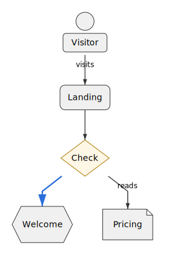
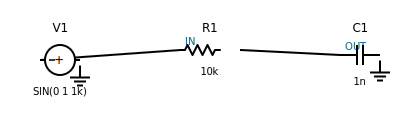
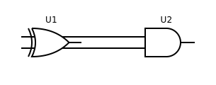

# Runiq

> A markdown-friendly diagram DSL with JSON twin that compiles to standards-compliant SVG

[](https://opensource.org/licenses/MIT)
[](https://www.typescriptlang.org/)
[](./packages)

**🚀 Status**: Phase 1 Complete - Core types, **249 shapes**, ELK layout, hierarchical containers!  
**⚡ NEW**: UML 2.5 Class Relationships - Multiplicity, Aggregation/Composition diamonds, Role names! 💎  
**⚡ NEW**: C4 Architecture diagrams - System Context, Containers, Components with official color palette! 🏗️  
**⚡ NEW**: UML Class Diagrams with generics, member-level edges, and design patterns! 🎨  
**⚡ NEW**: Mindmap diagrams for brainstorming & knowledge mapping - radial layout, 10 tests! 🧠  
**⚡ NEW**: Quantum circuit diagrams for quantum computing visualization - 12 gates, IBM Qiskit style! ⚛️

<!-- **⚡ NEW**: Pedigree charts for medical genetics & genealogy - 3 shapes, full notation support! 🧬   -->

**⚡ NEW**: Network topology diagrams - routers, firewalls, load balancers, and more! 🌐  
**⚡ NEW**: UML relationships - stereotypes (`<<include>>`, `<<extend>>`), line styles, arrow types!  
**⚡ NEW**: Control system support for control systems & signal processing!  
**⚡ NEW**: LaTeX & Simulink export for control systems and academic papers!  
**⚡ NEW**: P&ID (Piping & Instrumentation Diagrams) following ISA-5.1 standards! 🏭

## ✨ Features

### Software Diagrams

- **Two inputs, one AST**: Human-friendly DSL and 1:1 JSON format
- **Pure SVG output**: No HTML hacks, embed-safe for PowerPoint/Keynote/Google Slides
- **Pluggable system**: Extensible shapes, icons, layout engines, and themes
- **SvelteKit editor**: CodeMirror code editor with real-time preview
- **Standards compliant**: SVG 1.1/2.0 friendly with accessibility support

### C4 Architecture Diagrams (NEW! 🎉)

- **4 hierarchical levels**: System Context, Container, Component, Code (use UML)
- **Official C4 color palette**: Person (#08427B), System (#1168BD), Container (#438DD5), Component (#85BBF0)
- **Technology labels**: Multi-line labels with `\n` separator for app name + tech stack
- **Simon Brown's C4 model**: Industry-standard architecture visualization ([c4model.com](https://c4model.com/))
- **4 shape types**: Person (external actors), Software System, Container (apps/DBs), Component (code modules)
- **Microservices support**: Organize containers by architectural layer (frontend, backend, data)
- **Relationship labels**: Technology/protocol annotations ([HTTPS], [SQL/TCP], [JSON/REST])
- **Sample diagrams**: Banking system, microservices architecture, API components
- **Professional styling**: Consistent with C4 community standards

### UML Class Diagrams (NEW! 🎉)

- **3-Compartment structure**: Name, attributes, methods with automatic compartment hiding
- **Generic type support**: Single (`List<T>`), multiple (`Map<K,V>`), nested (`List<Map<K,V>>`), bounded (`T extends Comparable<T>`)
- **Visibility modifiers**: Public (+), private (-), protected (#), package (~)
- **Stereotypes**: «interface», «abstract» with proper guillemet rendering
- **Member-level edges**: Revolutionary syntax for FK relationships: `Order.customerId -> Customer.id`
- **Method signatures**: Full parameter lists with types and return values
- **Abstract methods**: Rendered in italic with `abstract:true` flag
- **Static members**: Support for static fields and methods (underlined in output)
- **Derived attributes**: `/` prefix for calculated fields
- **Default values**: Show field initialization values
- **Design patterns**: 6 comprehensive examples (inheritance, interfaces, generics, factory, observer, domain models)
- **Database modeling**: Perfect for entity-relationship diagrams with FK connections

### UML Relationships (ENHANCED! 🎉)

- **Stereotypes**: `<<include>>`, `<<extend>>`, `<<uses>>`, `<<implements>>`, custom stereotypes
- **Line styles**: Solid, dashed, dotted for different relationship types
- **Arrow types**:
  - Standard (filled) - associations
  - Hollow (open triangle) - generalization/inheritance
  - Open (V-shaped) - dependencies
  - None - undirected relationships
- **UML 2.5 Compliant Relationships**:
  - **Multiplicity/Cardinality**: `0..1`, `1`, `1..*`, `0..*`, `*`, `1..5` on both ends
  - **Aggregation**: Hollow diamond (◇) for shared ownership (has-a relationship)
  - **Composition**: Filled diamond (◆) for strong ownership (lifecycle dependency)
  - **Role Names**: Labels at source and target ends of associations
  - **Edge Types**: association, aggregation, composition, dependency, generalization, realization
  - **Navigability**: Directional indicators (parsing complete, rendering pending)
  - **Constraints**: `{ordered}`, `{unique}`, `{readonly}` (parsing complete, rendering pending)
- **Complete UML support**: Use case, class, sequence diagrams with proper notation
- **564 tests passing**: Comprehensive test coverage for all relationship features

### Electrical & Digital Circuits (NEW! 🎉)

- **Text-based circuit definition**: Write circuits in plain text with clear syntax
- **SPICE netlist export**: Automatic generation of simulation-ready netlists
- **Verilog HDL export**: Generate synthesizable Verilog for digital designs
- **IEEE schematic rendering**: Professional SVG schematics with standard symbols (22 symbols!)
- **Logic gate library**: AND, OR, NOT, XOR, NAND, NOR, BUFFER (IEEE/ANSI distinctive shapes)
- **Complete workflow**: Design → Simulate → Visualize from single source
- **Version control friendly**: Track circuit changes like code

### Control System Diagrams (NEW! 🎉)

- **Control system blocks**: Transfer functions, gain blocks, integrators, differentiators
- **Signal operations**: Summing junctions (+), multiply (×), divide (÷), compare
- **Standard notation**: Laplace domain (s), time delays (e^-sT), saturation blocks
- **Feedback loops**: Model closed-loop control systems with feedback paths
- **Engineering applications**: PID controllers, state-space models, signal processing
- **5 example diagrams**: Ready-to-use templates in `examples/control-diagrams/`

### Mindmap Diagrams (NEW! 🎉)

- **Radial layout**: Central node with branches radiating outward
- **Brainstorming**: Organize ideas hierarchically around central concepts
- **Knowledge mapping**: Create learning roadmaps and study guides
- **Project planning**: Break down complex projects into phases and tasks
- **Multiple levels**: Support for 3-4 hierarchical levels (main topics → subtopics → details)
- **Mixed shapes**: Use different shapes for different node types (topics, actions, metrics)
- **Custom styling**: Color-code by category, importance, or type
- **Flexible spacing**: Control node distance for clarity
- **4 example diagrams**: Simple brainstorming, project planning, learning roadmap, business strategy

<!-- ### Pedigree Charts (NEW! 🎉)

- **Medical genetics notation**: Standard symbols for genealogy and clinical genetics
- **Gender-specific shapes**: Male (square), female (circle), unknown sex (diamond)
- **Genetic status markers**: Affected (black fill), carrier (half-fill), normal (white)
- **Vital status**: Deceased individuals with diagonal line overlay
- **Relationship types**: Marriage (horizontal line, no arrow), consanguinity (double line)
- **Property-based syntax**: Inline `affected:true`, `carrier:true`, `deceased:true`
- **Standards compliant**: Follows medical/genetics pedigree conventions
- **5 example diagrams**: Inheritance patterns, consanguinity, multi-generation families -->

### Quantum Circuits (NEW! 🎉)

- **IBM Qiskit style**: Industry-standard quantum circuit visualization
- **12 quantum gates**: Pauli (X, Y, Z), Hadamard, Phase (S, T), multi-qubit primitives
- **Single-qubit gates**: Basis transformations, superposition, phase rotations
- **Multi-qubit operations**: Control dots, CNOT targets, SWAP gates
- **Measurement & utilities**: Measurement boxes, qubit wires, circuit barriers
- **Color-coded gates**: Red (Pauli), green (Hadamard), yellow (phase), blue (measurement)
- **4 example circuits**: Bell state, quantum teleportation, Grover search, QFT
- **Educational focus**: Visualize quantum algorithms without quantum simulation

### Network Topology (NEW! 🎉)

- **7 network shapes**: Routers, switches, firewalls, servers, clouds, WANs, load balancers
- **Infrastructure modeling**: Design network architectures visually
- **Standard symbols**: Industry-recognized network diagram notation
- **Security visualization**: Firewalls, DMZs, security zones
- **Cloud integration**: Multi-cloud and hybrid architectures
- **Enterprise ready**: Data centers, campus networks, branch offices

### P&ID Diagrams (NEW! 🎉)

- **ISA-5.1 compliant**: Industry-standard Piping & Instrumentation Diagrams
- **64 equipment types**: Vessels, pumps, compressors, heat exchangers, valves, safety equipment
- **27+ instrument types**: Transmitters, controllers, indicators, alarms following tag notation
- **Complete tag notation**: FT-101, TIC-201, PAH-903 - standard ISA-5.1 naming
- **Line types**: Process (solid), utility (blue), signal (dashed), electrical (dotted)
- **Control loops**: Flow, temperature, pressure, level, composition, pH, speed control
- **Safety systems**: PSVs, rupture disks, alarm systems (high/low/high-high/low-low)
- **Material specifications**: 12 materials (CS, SS316, Hastelloy, PTFE, etc.)
- **Pressure ratings**: ANSI (150#-2500#) and PN (PN10-PN40) classes
- **Pipe schedules**: SCH10-SCH160, STD, XS, XXS
- **5 example diagrams**: Tank/pump, heat exchanger, distillation, reactor safety, compressor

## 🚀 Quick Start

```bash
# Clone the repository
git clone https://github.com/jgreywolf/runiq.git
cd runiq

# Install dependencies (requires pnpm)
pnpm install

# Build all packages
pnpm build

# Run tests
pnpm test

# Start the editor
pnpm dev
```

## 📦 Packages

### Core Packages

| Package                                                    | Description                        | Tests  |
| ---------------------------------------------------------- | ---------------------------------- | ------ |
| [`@runiq/core`](./packages/core)                           | Core types, shapes, and registries | 743 ✅ |
| [`@runiq/parser-dsl`](./packages/parser-dsl)               | Langium-based DSL parser           | 114 ✅ |
| [`@runiq/layout-base`](./packages/layout-base)             | ELK layout engine adapter          | 40 ✅  |
| [`@runiq/renderer-svg`](./packages/renderer-svg)           | SVG rendering engine               | 30 ✅  |
| [`@runiq/web`](./packages/web)                             | Browser SDK (parse→layout→render)  | 2 ✅   |
| [`@runiq/io-json`](./packages/io-json)                     | JSON import/export                 | 28 ✅  |
| [`@runiq/icons-fontawesome`](./packages/icons-fontawesome) | Font Awesome icon provider         | -      |
| [`@runiq/cli`](./packages/cli)                             | Command-line interface             | -      |

### Electrical & Digital Circuit Packages

| Package                                                      | Description                          | Tests |
| ------------------------------------------------------------ | ------------------------------------ | ----- |
| [`@runiq/export-spice`](./packages/export-spice)             | SPICE netlist generator (analog)     | 18 ✅ |
| [`@runiq/export-verilog`](./packages/export-verilog)         | Verilog HDL generator (digital)      | 15 ✅ |
| [`@runiq/renderer-schematic`](./packages/renderer-schematic) | IEEE-standard schematic SVG renderer | 46 ✅ |

### Control system Diagram Export Packages (NEW! 🎉)

| Package                                                | Description                                  | Tests |
| ------------------------------------------------------ | -------------------------------------------- | ----- |
| [`@runiq/export-latex`](./packages/export-latex)       | LaTeX/TikZ exporter for academic papers      | 8 ✅  |
| [`@runiq/export-simulink`](./packages/export-simulink) | Simulink MDL exporter for MATLAB integration | 8 ✅  |

### Applications

| App                             | Description          |
| ------------------------------- | -------------------- |
| [`runiq-editor`](./apps/editor) | SvelteKit web editor |

### Use in web apps (npm)

Install the browser SDK and render diagrams directly in your app:

```bash
pnpm add @runiq/web
```

```ts
import { renderRuniqToSvg } from '@runiq/web';

const text = `diagram "My Diagram" {\n  shape A as @rectangle label:"Hello"\n  shape B as @rectangle label:"World"\n  A -link-> B\n}`;
const { svg } = await renderRuniqToSvg(text);
```

CLI usage:

```bash
pnpm add -g @runiq/cli
runiq render input.runiq > out.svg
```

## Parser Technology

Runiq uses **[Langium](https://langium.org/)** for parsing - a modern TypeScript language engineering framework with:

✅ **Built-in LSP support** - Ready for VS Code extensions and CodeMirror editor  
✅ **Auto-generated typed AST** - TypeScript types derived from grammar  
✅ **Declarative grammar** - Clean `.langium` syntax  
✅ **Production-proven** - Used by Mermaid.js for new diagrams  
✅ **Active maintenance** - Regular updates from TypeFox/Eclipse

## Apps

- `editor` - SvelteKit editor with CodeMirror
- `playground` - Simple demo

## Example DSL

### Software Diagram - Basic Flowchart

```runiq
diagram "Auth Flow"
direction LR

style default fill:#f7f7ff strokeColor:#444 font:Inter fontSize:14
style decision fill:#fff7e6 strokeColor:#aa7700

shape User     as @actor   label:"Visitor" icon:fa/user
shape Landing  as @rounded label:"Landing Page"
shape Check    as @rhombus label:"Signed up?" style:decision
shape Welcome  as @hexagon     label:"Welcome"

User -> Landing : visits
Landing -> Check
Check -yes-> Welcome
Check[no]  -> Pricing : reads
```

**Output:**



[See full example →](./examples/auth-flow.runiq)

### Electrical Circuit - RC Lowpass Filter (NEW!)

```runiq
electrical "RC Lowpass Filter" {
  net IN, OUT, GND

  part V1 type:V source:"SIN(0 1 1k)" pins:(IN,GND)
  part R1 type:R value:"10k" pins:(IN,OUT)
  part C1 type:C value:"1n" pins:(OUT,GND)

  analysis tran "0 5m"
}
```

**This generates:**

- 📄 **SPICE Netlist** for simulation (ngspice/LTspice compatible)
- 🎨 **IEEE Schematic SVG** with professional symbols and labels

**Output:**



[See more electrical examples →](./examples/electrical/)

### Digital Circuit - Half Adder (NEW!)

```runiq
digital "Half Adder" {
  net A, B, SUM, CARRY

  gate U1 type:XOR inputs:(A,B) output:SUM
  gate U2 type:AND inputs:(A,B) output:CARRY
}
```

**This generates:**

- 💻 **Verilog HDL** module for synthesis/simulation
- 🎨 **IEEE Logic Gate Schematic** with distinctive gate symbols (curved OR, flat AND, etc.)
- 📊 **Truth table validation** for correctness checking

**Output:**



[See more digital examples →](./packages/export-verilog/examples/)

### C4 Architecture - System Context (NEW!)

```runiq
diagram "Banking System - Context"
direction TB

shape customer as @c4Person label:"Customer"
shape bankingSystem as @c4System label:"Internet Banking\\nSystem"
shape emailSystem as @c4System label:"Email System"
shape mainframe as @c4System label:"Mainframe\\nBanking System"

customer -Uses-> bankingSystem
bankingSystem -Sends emails-> emailSystem
bankingSystem -Uses-> mainframe
```

**Features:**

- ✅ **Official C4 color palette** - Professional blue tones for each level
- ✅ **Multi-line labels** - Use `\\n` for system name + description
- ✅ **Technology labels** - Add protocols to edges: `-Uses [HTTPS]->`
- ✅ **4 shape types** - Person, System, Container, Component

[See full C4 guide →](./docs/examples/c4-architecture.md)

### With Containers

```runiq
diagram "Microservices" {
  direction LR

  container backend "Backend Services"
    fillColor: "#f3e5f5"
    strokeColor: "#7b1fa2"
    strokeWidth: 3 {
    shape auth as @hexagon label: "Auth Service"
    shape api as @hexagon label: "API Gateway"
    shape users as @hexagon label: "User Service"

    api -> auth
    api -> users
  }

  shape web as @rounded label: "Web UI"
  web -> api : HTTPS
}
```

_SVG output coming soon - see [examples/microservices.runiq](./examples/microservices.runiq)_

[See more container examples →](./examples/)

### UML Use Case Diagram with Relationships (NEW! 🎉)

```runiq
diagram: use-case
title: "Banking System"

# Actors
actor Customer "Bank Customer"
actor Staff "Bank Staff"

# System boundary
system-boundary Bank "ATM System" {
  ellipse-wide Withdraw "Withdraw Cash"
  ellipse-wide Deposit "Deposit Funds"
  ellipse-wide CheckBalance "Check Balance"
  ellipse-wide Authenticate "Authenticate User"
  ellipse-wide PrintReceipt "Print Receipt"
}

# Associations (solid lines, standard arrows)
Customer -> Withdraw
Customer -> Deposit
Staff -> CheckBalance

# `<<include>>` - Required dependency (dashed, open arrow)
Withdraw -> Authenticate stereotype: "include" lineStyle: "dashed" arrowType: open
Deposit -> Authenticate stereotype: "include" lineStyle: "dashed" arrowType: open

# `<<extend>>` - Optional extension (dashed, open arrow)
PrintReceipt -> Withdraw stereotype: "extend" lineStyle: "dashed" arrowType: open
```

**This generates:**

- 👤 **Actor shapes** - Stick figures for external users/systems
- ⭕ **Use case ovals** - Horizontal ellipses for system functionality
- 📦 **System boundaries** - Dotted rectangles grouping related use cases
- 🔗 **Associations** - Connections showing actor-use case relationships
- 📋 **Stereotypes** - `<<include>>`, `<<extend>>` with proper UML notation

_SVG output coming soon - see [examples/use-case-diagram/banking-advanced.runiq](./examples/use-case-diagram/banking-advanced.runiq)_

[See all use case examples →](./examples/use-case-diagram/)

- 🎨 **Line styles** - Solid, dashed, dotted lines for different semantics
- ➡️ **Arrow types** - Standard, hollow, open arrows for relationship types

[See more use case examples →](./examples/use-case-diagram/)

### UML Class Diagram - E-Commerce Domain Model (NEW!)

```runiq
diagram "Domain Model" {
  direction TB

  // Customer entity
  shape Customer as @class label:"Customer"
    attributes:[
      {name:"id" type:"int" visibility:private},
      {name:"email" type:"string" visibility:private}
    ]
    methods:[
      {name:"placeOrder" params:[{name:"cart" type:"Cart"}] returnType:"Order" visibility:public}
    ]

  // Order entity with foreign key
  shape Order as @class label:"Order"
    attributes:[
      {name:"id" type:"int" visibility:private},
      {name:"customerId" type:"int" visibility:private},
      {name:"total" type:"decimal" visibility:private}
    ]
    methods:[
      {name:"calculateTotal" returnType:"decimal" visibility:public}
    ]

  // Member-level edge showing FK relationship
  Order.customerId -> Customer.id
}
```

**This generates:**

- 📦 **3-compartment boxes** - Name, attributes, methods (auto-hides empty sections)
- 🔤 **Generic types** - `List<T>`, `Map<K,V>`, nested and bounded generics
- 🔒 **Visibility** - +public, -private, #protected, ~package symbols
- 🏷️ **Stereotypes** - «interface», «abstract» with proper guillemets
- 🔗 **Member-level edges** - Revolutionary FK syntax: `Order.customerId -> Customer.id`
- ⚙️ **Method signatures** - Full parameters with types and return values

[See all class diagram examples →](./examples/class-diagrams/)

- Simple inheritance (abstract classes)
- Interface implementation
- Generic collections
- Design patterns (Factory, Observer)
- Domain models with foreign keys

### P&ID - Process Flow with Control (NEW! 🎉)

```runiq
pid "Simple Process Flow" {
  // Equipment
  equipment T-101 type:storageTank volume:1000 unit:L material:CS rating:150#
  equipment P-101 type:pumpCentrifugal flowRate:50 unit:m³/h material:CS
  equipment FCV-101 type:valveControl rating:150#

  // Instruments (ISA-5.1 notation)
  instrument FT-101 type:flowTransmitter range:(0,100) unit:m³/h loop:101 location:field
  instrument FIC-101 type:flowIndicatorController range:(0,100) unit:m³/h loop:101 location:panel

  // Process Lines
  line process from:T-101.outlet to:P-101.inlet size:3 unit:in schedule:SCH40 material:CS
  line process from:P-101.discharge to:FCV-101.inlet size:2 unit:in schedule:SCH40 material:CS

  // Signal Lines
  line signal from:FT-101 to:FIC-101
  line signal from:FIC-101 to:FCV-101

  // Control Loop
  loop 101 controlled_variable:flow setpoint:40 unit:m³/h controller:FIC-101 mode:auto

  // Process Specifications
  fluid organic
  pressure 6 bar operating
  flowRate 50 m³/h
}
```

**This generates:**

- 🏭 **ISA-5.1 compliant symbols** - Standard P&ID equipment and instrument notation
- 🏷️ **Tag notation** - FT-101, FIC-101 following ISA standards
- 📏 **Engineering specs** - Material (CS, SS316), ratings (150#, 300#), schedules (SCH40, SCH80)
- 🔄 **Control loops** - Flow, temperature, pressure, level control with setpoints
- 📊 **Line types** - Process (solid), utility (blue), signal (dashed), electrical (dotted)
- 🛡️ **Safety systems** - PSVs, rupture disks, alarm systems (high/low/high-high/low-low)

[See all P&ID examples →](./examples/pid/)

- Simple tank and pump system
- Heat exchanger with temperature control
- Distillation column with multiple loops
- Reactor with comprehensive safety systems
- Two-stage compressor with anti-surge control

## 🎯 Current Status (October 2025)

### ✅ Completed

**Software Diagrams:**

- [x] **61 shapes implemented** (52 flowchart/diagram + 9 block diagram shapes! 🎉)
  - Flowchart: Actors, circles, data/documents, data I/O, storage, process, specialized, annotations
  - Control system Diagrams: Transfer functions, gain, integrator, differentiator, delay, saturation, junctions
- [x] **UML Class Diagrams** - Complete! 🎉
  - 3-compartment rendering (name, attributes, methods)
  - Generic type support (single, multiple, nested, bounded)
  - Visibility modifiers (+, -, #, ~)
  - Stereotypes («interface», «abstract»)
  - Member-level edge connections for FK relationships
  - 18 shape tests + 8 parser tests passing
  - 6 comprehensive examples (patterns, domain models)
  - [See Class Diagram Examples →](./examples/class-diagrams/)
- [x] **ELK layout engine integrated** - Replaced Dagre with superior Eclipse Layout Kernel
- [x] **SVG renderer functional** - Standards-compliant output
- [x] **Hierarchical containers - Complete! 🎉**
  - Full DSL syntax support for containers with styling and layout options
  - Nested containers with **two-pass layout algorithm** ✅
  - Deep nesting support (3+ levels) with automatic sizing ✅
  - Cross-container edges fully supported
  - 148 container-related tests (100% passing)
  - [See Container Documentation →](./docs/containers.md)

**Electrical Circuits (NEW!):**

- [x] **Profile-based architecture** - Multi-domain support (electrical, digital)
- [x] **Electrical DSL** - Clean syntax for circuits with parts, nets, analysis
- [x] **SPICE exporter** - Automatic netlist generation (18/18 tests ✅)
- [x] **IEEE schematic renderer** - Professional SVG schematics (21/21 tests ✅)
  - 8 standard symbols: R, C, L, V, I, GND, D, LED
  - Automatic layout and wire routing
  - Configurable styling and labels
  - [See Schematic Renderer →](./packages/renderer-schematic/)
- [x] **Complete workflow validated** - 5 working examples with SPICE + schematics
  - [See Electrical Examples →](./examples/electrical/)

**Testing & Infrastructure:**

- [x] **Test coverage** - 600+ tests passing across packages
- [x] **Monorepo architecture** - Clean package separation with pnpm workspaces

### 🚧 In Progress (Oct 17, 2025)

**Software Diagrams:**

- [x] **Hierarchical Containers** - ALL PHASES COMPLETE! 🎉
- [x] **UML Relationships** - Stereotypes, line styles, arrow types complete
- [x] **Use Case Diagrams** - Actors, use cases, system boundaries
- [x] **Control system Diagrams** - Control systems with LaTeX/Simulink export
- [ ] **Pedigree Charts** - NEXT UP! Family trees for genealogy & genetics

**Research & Planning:**

See [docs/new-diagram-types-research.md](./docs/new-diagram-types-research.md) for analysis of:

- ✅ Pedigree charts (genealogy, medical genetics) - **READY TO IMPLEMENT**
- Quantum circuit diagrams (quantum computing education)
- Network topology diagrams (IT infrastructure)
- UML timing diagrams (embedded systems, protocols)

### 🔮 Roadmap

**High Priority - Specialized Diagrams:**

1. **Pedigree Charts** (IN PROGRESS) - Family trees, medical genetics, genealogy
2. **Network Topology** (NEXT) - IT infrastructure, cloud architecture
3. **UML Timing Diagrams** (FUTURE) - Real-time systems, protocol timing

**Medium Priority - Electrical/Digital:**

1. **Enhanced Circuit Symbols** - Transistors, MOSFETs, op-amps, analog ICs
2. **Advanced Wire Routing** - Orthogonal routing, junction dots, bus notation
3. **Component Rotation** - 90°/180°/270° orientation for circuits
4. **Digital Simulation** - Integrate with Icarus Verilog or similar tools
5. **PCB Export** - KiCad footprint mapping for PCB design

## 🧪 Testing

```bash
# Run all tests
pnpm test

# Run tests for specific package
cd packages/core && pnpm test

# Run tests in watch mode (for development)
cd packages/core && pnpm test:watch

# Build all packages
pnpm build
```

**Test Coverage:**

**Software Diagrams:**

- Core: 345 tests (types, shapes, validation)
- Layout: 24 tests (ELK adapter)
- Renderer: 30 tests (SVG output)

**Electrical Circuits:**

- Parser: 5 tests (electrical profile parsing)
- SPICE Exporter: 18 tests (netlist generation)
- Schematic Renderer: 21 tests (IEEE symbol rendering)

**Total: 600+ tests passing** ✅

## 📋 Requirements

- **Node.js** >= 18
- **pnpm** >= 8.15.0

## 🤝 Contributing

Contributions are welcome! This project follows **Test-Driven Development (TDD)**:

1. **Write tests first** (Red) - Define expected behavior
2. **Implement minimal code** (Green) - Make tests pass
3. **Refactor** (Refactor) - Keep tests passing while improving code

See [`.github/copilot-instructions.md`](./.github/copilot-instructions.md) for detailed development guidelines.

## 📊 Shape Library (249 Total)

Runiq provides **249 professional shapes** across 17 categories:

| Category          | Count | Description                                                   |
| ----------------- | ----- | ------------------------------------------------------------- |
| **Basic**         | 22    | Geometric shapes (rectangles, circles, polygons)              |
| **Flowchart**     | 14    | ISO 5807 flowchart symbols                                    |
| **Storage**       | 7     | Database, cylinder, disk storage                              |
| **Rect Variants** | 7     | Specialized rectangles (framed, tagged, notched)              |
| **Control**       | 10    | Transfer functions, gain, integrator, summing junctions       |
| **Special**       | 7     | Text blocks, braces, lightning, hourglass                     |
| **Charts**        | 7     | Pie, bar, line, radar, venn, sankey                           |
| **Glyphsets**     | 58    | SmartArt-style templates (pyramid, matrix, cycle, org charts) |
| **Network**       | 7     | Server, router, switch, firewall, cloud                       |
| **Quantum**       | 12    | Quantum gates (X, Y, Z, H, S, T, CNOT, SWAP)                  |
| **UML**           | 54    | Class, state, activity, sequence, component diagrams          |
| **Pedigree**      | 3     | Medical genetics symbols (male, female, unknown)              |
| **C4**            | 4     | C4 architecture (person, system, container, component)        |
| **BPMN**          | 6     | Business process modeling notation                            |
| **AWS**           | 6     | AWS service shapes (EC2, S3, Lambda, RDS, VPC, API Gateway)   |
| **ERD**           | 6     | Entity-relationship diagram shapes                            |
| **Data Flow**     | 6     | DFD shapes (external entity, process, data store)             |

See [Shape Reference](/docs/reference/shapes.md) for complete catalog with examples.

## 🎨 Supported Diagram Types

### Software Diagrams

| Status | Type              | Notes                                 |
| ------ | ----------------- | ------------------------------------- |
| ✅     | Flowcharts        | Full support                          |
| ✅     | Sequence diagrams | Full support                          |
| ✅     | Use case diagrams | NEW! Actors, use cases, boundaries 🎉 |
| ✅     | Class diagrams    | Full support                          |
| ✅     | State diagrams    | Full support                          |
| ✅     | ER diagrams       | Full support                          |
| ✅     | C4 diagrams       | Container support complete! 🎉        |
| 🟡     | BPMN              | Swim lanes coming soon                |

### Electrical & Digital Circuits (NEW!)

| Status | Type                | Notes                                     |
| ------ | ------------------- | ----------------------------------------- |
| ✅     | Analog circuits     | R, C, L, V, I sources + SPICE export      |
| ✅     | Power supplies      | Voltage dividers, filters, regulators     |
| ✅     | LED circuits        | Current limiting, indicators              |
| ✅     | Schematic rendering | IEEE-standard SVG schematics              |
| ✅     | Digital logic       | Grammar ready, Verilog export coming soon |
| 🟡     | Mixed-signal        | Analog + digital in same circuit (future) |

<!-- ### Medical & Genetics (NEW!)

| Status | Type            | Notes                                          |
| ------ | --------------- | ---------------------------------------------- |
| ✅     | Pedigree charts | Male/female/unknown shapes, genetic markers 🎉 |
| ✅     | Inheritance     | Affected, carrier, normal status               |
| ✅     | Relationships   | Marriage, consanguinity (double line)          |
| ✅     | Vital status    | Deceased marker (diagonal line)                | -->

## 🚀 What Makes Runiq Unique?

**For Software Engineers:**

- ✨ Version control friendly (plain text)
- ✨ Embed diagrams in Markdown/docs
- ✨ Consistent styling across teams
- ✨ No vendor lock-in (open format)

**For Hardware Engineers (NEW!):**

- ⚡ **Text → SPICE + Schematic** from single source (no other tool does this!)
- ⚡ Design → Simulate → Document workflow
- ⚡ Version control electrical circuits like code
- ⚡ IEEE-standard professional schematics
- ⚡ Automatic ground normalization
- ⚡ Compatible with industry tools (ngspice, LTspice)
  | 🟡 | Mind maps | Partial support |
  | 🟡 | Timeline/Gantt | Time-based layouts planned |

[See full analysis of 45 diagram types →](./docs/diagram-type-support.md)

## 📄 License

MIT © 2025 Justin Greywolf

## 🙏 Acknowledgments

- [Eclipse Layout Kernel (ELK)](https://www.eclipse.org/elk/) - Professional graph layout
- [Langium](https://langium.org/) - Language engineering toolkit
- [Font Awesome](https://fontawesome.com/) - Icon library
- [SvelteKit](https://kit.svelte.dev/) - Web framework
- [Vitest](https://vitest.dev/) - Testing framework

---

**Built with ❤️ using Test-Driven Development** | [Report Issues](https://github.com/jgreywolf/runiq/issues) | [Contribute](https://github.com/jgreywolf/runiq/pulls)
