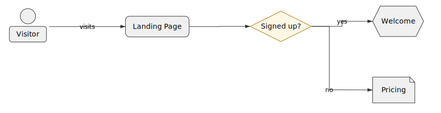

# Flowchart Examples

Flowcharts visualize process flows, decision logic, and algorithms.

## Authentication Flow

A complete user authentication process with validation, database lookup, and error handling.

### DSL Code

```runiq
diagram "User Authentication Flow" direction: TB

# Entry point
shape Login as @rounded label: "User Login"

# Process steps
shape ValidateInput as @rect label: "Validate Input"
shape CheckDB as @cyl label: "Check Database"
shape VerifyPassword as @rhombus label: "Password Correct?"

# Success path
shape GenerateToken as @rect label: "Generate JWT"
shape Success as @hex label: "Success"

# Error paths
shape InvalidInput as @doc label: "Invalid Input Error"
shape WrongPassword as @doc label: "Wrong Password Error"

# Connections
Login -> ValidateInput

# Validation branch
ValidateInput[valid] -> CheckDB
ValidateInput[invalid] -> InvalidInput

# Authentication branch
CheckDB -> VerifyPassword
VerifyPassword[yes] -> GenerateToken
VerifyPassword[no] -> WrongPassword

# Success
GenerateToken -> Success
```

### Generated SVG



### Explanation

**Shapes Used:**

- `@rounded` - Terminal points (start/end)
- `@rect` - Process steps
- `@rhombus` - Decisions
- `@hex` - Preparation/success
- `@cyl` - Database
- `@doc` - Documents/errors

**Flow:**

1. User enters credentials
2. Input validation (valid/invalid branch)
3. Database lookup
4. Password verification (yes/no branch)
5. JWT token generation on success
6. Multiple error paths for different failures

## Containerized Architecture

Group related components using containers:

```runiq
diagram "Three-Tier Web App" direction: TB

container "Frontend" fillColor: "#e3f2fd" {
  shape Browser as @rect label: "Web Browser"
  shape UI as @rect label: "React UI"
}

container "Backend" fillColor: "#fff3e0" {
  shape API as @rect label: "REST API"
  shape Auth as @rect label: "Auth Service"
  shape Business as @rect label: "Business Logic"
}

container "Data Layer" fillColor: "#e8f5e9" {
  shape DB as @cyl label: "PostgreSQL"
  shape Cache as @cyl label: "Redis"
}

# Cross-container connections
Browser -> UI
UI -> API
API -> Auth
API -> Business
Business -> DB
Business -> Cache
```

**Features:**

- Three containers for separation of concerns
- Color-coded layers (blue, orange, green)
- Database and cache in data layer
- Clear service boundaries

## Data Processing Pipeline

A linear pipeline with conditional branching:

```runiq
diagram "ETL Pipeline" direction: LR

shape Extract as @rect label: "Extract Data"
shape Transform as @rect label: "Transform"
shape Validate as @rhombus label: "Valid?"
shape Load as @cyl label: "Load to DB"
shape ErrorLog as @doc label: "Error Log"
shape Archive as @hex label: "Archive"

Extract -> Transform
Transform -> Validate
Validate[yes] -> Load
Validate[no] -> ErrorLog
Load -> Archive
ErrorLog -> Archive
```

**Use Case:** ETL (Extract, Transform, Load) process

- Left-to-right flow (`direction: LR`)
- Validation decision point
- Error handling path
- Archive as final step for both success and errors

## Algorithm Flowchart

Visualize algorithm logic with loops:

```runiq
diagram "Bubble Sort Algorithm" direction: TB

shape Start as @rounded label: "Start"
shape Init as @rect label: "i = 0"
shape OuterCheck as @rhombus label: "i < n-1?"
shape InnerInit as @rect label: "j = 0"
shape InnerCheck as @rhombus label: "j < n-i-1?"
shape Compare as @rhombus label: "arr[j] > arr[j+1]?"
shape Swap as @rect label: "Swap"
shape IncrementJ as @rect label: "j++"
shape IncrementI as @rect label: "i++"
shape End as @rounded label: "End"

Start -> Init
Init -> OuterCheck
OuterCheck[yes] -> InnerInit
OuterCheck[no] -> End
InnerInit -> InnerCheck
InnerCheck[yes] -> Compare
InnerCheck[no] -> IncrementI
Compare[yes] -> Swap
Compare[no] -> IncrementJ
Swap -> IncrementJ
IncrementJ -> InnerCheck
IncrementI -> OuterCheck
```

**Features:**

- Nested loops (outer and inner)
- Multiple decision points
- Loop back edges
- Clear algorithm structure

## State Machine

Model state transitions:

```runiq
diagram "Order State Machine" direction: LR

shape New as @rounded label: "New Order"
shape Pending as @rect label: "Pending Payment"
shape Processing as @rect label: "Processing"
shape Shipped as @rect label: "Shipped"
shape Delivered as @hex label: "Delivered"
shape Cancelled as @doc label: "Cancelled"
shape Refunded as @doc label: "Refunded"

# Happy path
New -> Pending label: "create"
Pending -> Processing label: "pay"
Processing -> Shipped label: "ship"
Shipped -> Delivered label: "deliver"

# Cancellation paths
New -> Cancelled label: "cancel"
Pending -> Cancelled label: "cancel"
Processing -> Cancelled label: "cancel"

# Refund path
Delivered -> Refunded label: "refund"
```

**Use Case:** E-commerce order lifecycle

- States as shapes
- Transitions as edges with labels
- Multiple paths to cancelled state
- Separate refund path from delivered

## Best Practices

::: tip Shape Selection

- **@rounded**: Start/end states
- **@rect**: Process/action steps
- **@rhombus**: Decisions (branching)
- **@hex**: Preparation/success states
- **@cyl**: Data stores
- **@doc**: Documents/outputs
  :::

::: tip Layout Direction

- **TB** (top-bottom): Sequential processes, hierarchies
- **LR** (left-right): Timelines, pipelines
- **BT** (bottom-top): Reverse flows
- **RL** (right-left): Eastern reading order
  :::

::: tip Edge Labels
Place labels on the source for conditional branches:

```runiq
Decision[yes] -> Success
Decision[no] -> Failure
```

:::

## Next Steps

- [Use Case Diagrams →](/examples/use-case) - Actor interactions
- [Container Diagrams →](/examples/containers) - Architecture models
- [Shape Reference →](/reference/shapes) - All 54 shapes

---

## Download Examples

All example `.runiq` files are available in the [GitHub repository](https://github.com/jgreywolf/runiq/tree/main/examples).

```bash
git clone https://github.com/jgreywolf/runiq.git
cd runiq/examples
```
